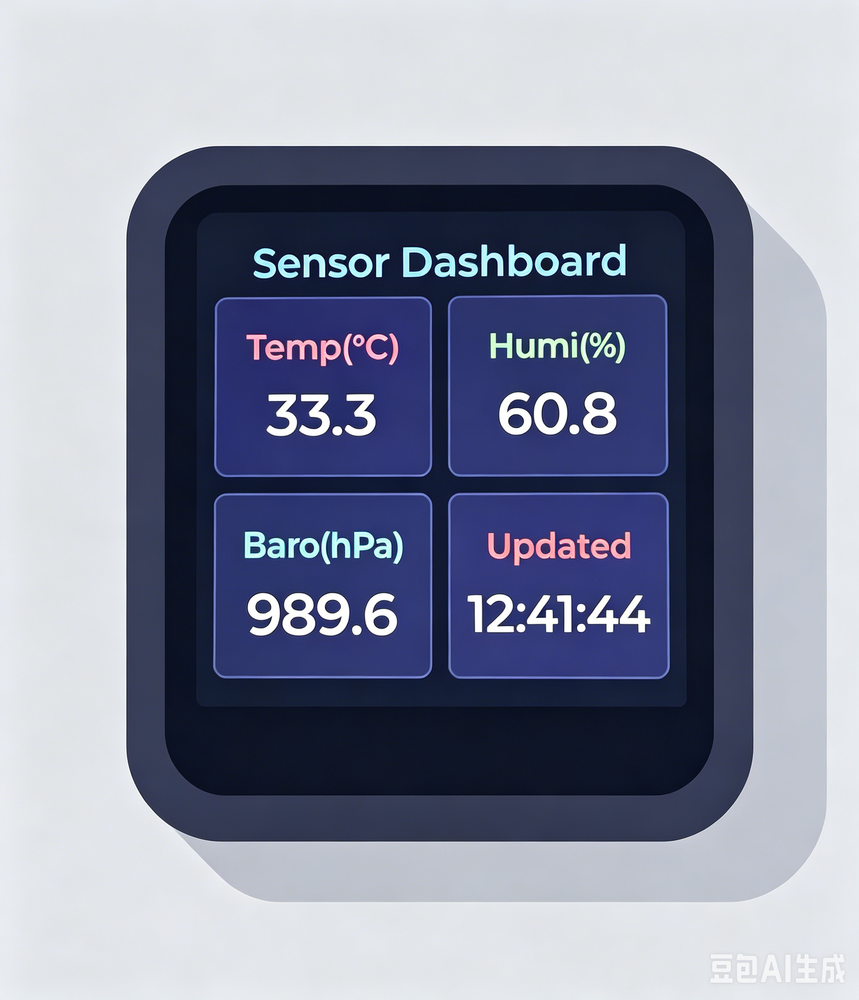
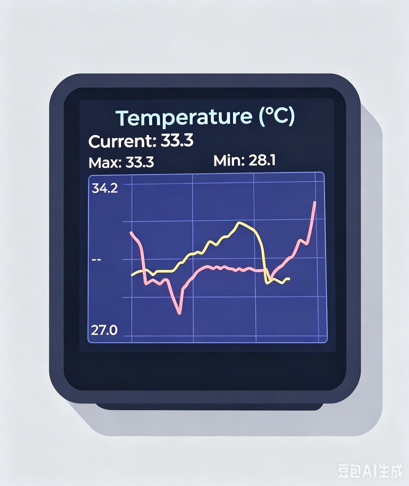
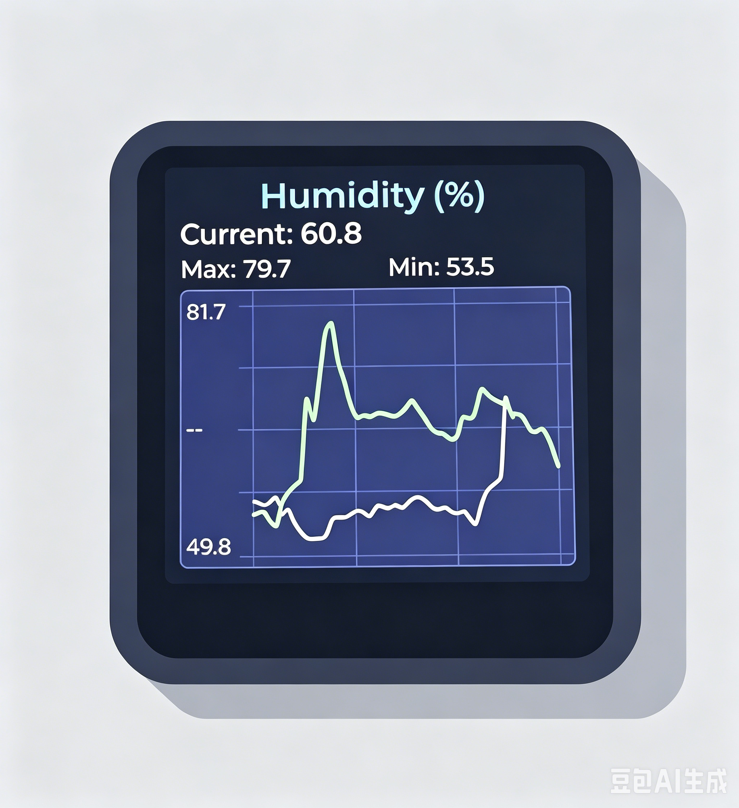
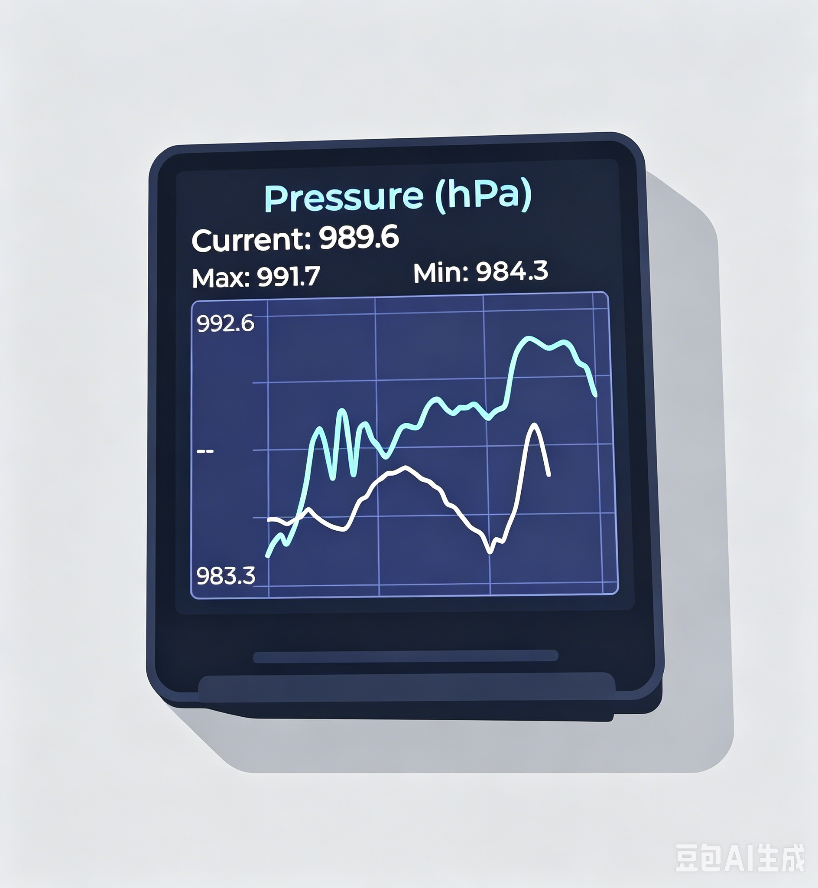
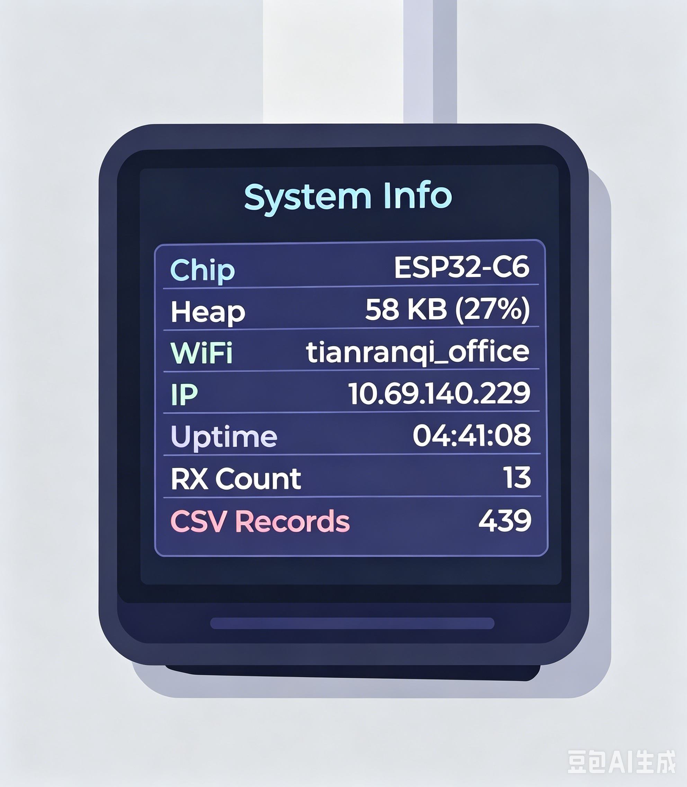

# ESP32-C6 MQTT Sensor Dashboard

基于 **ESP32-C6 + 1.3寸 ST7789 LCD (240x240)** 的 MQTT 传感器数据监控仪表盘。通过 MQTT TLS 加密协议接收 JSON 格式的传感器数据，实时显示温度、湿度、气压，并支持折线图历史趋势、SD 卡数据记录、昨日数据对比等丰富功能。

---

## 📸 界面预览

| 仪表盘                           | 温度折线图                       |
|:--------------------------------:|:--------------------------------:|
|  |  |
| **湿度折线图**                   | **气压折线图**                   |
|  |  |
| **系统信息**                     |                                  |
|  |                                  |

---

## ✨ 功能特性

### 核心功能

- **MQTT TLS 加密通信** - 支持 8883 端口的加密 MQTT 连接，WiFiClientSecure
- **JSON 数据解析** - 使用 ArduinoJson 解析传感器数据
- **自适应 Y 轴** - 根据数据范围自动调整刻度，小波动也能看清
- **昨日数据对比** - 折线图中灰色虚线显示昨日同时段数据，方便对比趋势

### 界面系统（5 个界面循环切换）

| 界面 | 名称            | 说明                                 |
| ---- | --------------- | ------------------------------------ |
| 1    | **Dashboard**   | 2×2 网格仪表盘 (温度/湿度/气压/时间) |
| 2    | **Temperature** | 温度大图折线图 + 昨日对比            |
| 3    | **Humidity**    | 湿度大图折线图 + 昨日对比            |
| 4    | **Pressure**    | 气压大图折线图 + 昨日对比            |
| 5    | **System Info** | 系统信息面板                         |

### 按键操作

| 操作                | 功能            | 说明                        |
| ------------------- | --------------- | --------------------------- |
| **短按** BOOT       | 切换界面        | 按 50ms~1s，5 个界面循环    |
| **长按** BOOT (>1s) | 旋转屏幕        | 0° → 90° → 180° → 270° 循环 |
| **自动切换**        | 每 10s 自动轮播 | 无需手动操作                |

### 数据显示

- **实时最大/最小值** - 每个图表显示历史最大值和最小值
- **连接状态指示** - 标题颜色：蓝色=已连接，红色=未连接
- **当前值显示** - 每个折线图上方显示最新数值

### 数据存储

- **SD 卡 CSV 记录** - 自动将接收到的数据追加到 SD 卡
- **开机历史加载** - 启动时自动从 SD 卡加载最近 50 条数据填充图表
- **时间戳去重** - 相同时间戳的数据不会重复写入
- **CSV 文件格式** - `sensor_data.csv`，含表头 `timestamp,temp,humi,baro`

### 网络特性

- **多组 WiFi 自动切换** - 扫描周围网络，按优先级列表自动连接第一个可用的 WiFi
- **MQTT 断线重连** - 自动检测并重连，带节流控制
- **网络重试节流** - WiFi 重试间隔 10s，MQTT 重试间隔 5s

### 其他

- **深色主题 UI** - GitHub 暗色风格 (#0D1117 背景)
- **屏幕旋转** - 支持 0°/90°/180°/270° 旋转
- **背光控制** - 可调节 LCD 背光亮度

---

## 🛠 硬件需求

| 组件      | 型号             | 说明                                |
| --------- | ---------------- | ----------------------------------- |
| 主控      | **ESP32-C6**     | WiFi 6 + BLE 5，RISC-V 架构         |
| 显示屏    | **1.3寸 ST7789** | 240×240 像素，SPI 接口              |
| 按键      | **BOOT (GPIO9)** | 用于切换界面和旋转屏幕              |
| SD 卡模块 | **SPI 模式**     | 可选，用于数据记录 (CS 引脚: GPIO4) |

---

## 📌 引脚连接

```
ST7789 LCD 引脚:
  SCLK  → GPIO7    (SPI 时钟)
  MOSI  → GPIO6    (SPI 数据)
  MISO  → GPIO5    (SPI MISO)
  CS    → GPIO14   (片选)
  DC    → GPIO15   (数据/命令选择)
  RST   → GPIO21   (复位)
  BLK   → GPIO22   (背光，PWM 控制)

SD 卡模块:
  CS    → GPIO4    (片选)
  MOSI  → GPIO6    (共用 SPI 总线)
  MISO  → GPIO5    (共用 SPI 总线)
  SCLK  → GPIO7    (共用 SPI 总线)
```

---

## 📂 项目结构

```
mqtt_helper/
├── mqtt_helper.ino        # 主程序 (UI创建、MQTT回调、WiFi连接、主循环)
├── config.h               # WiFi/MQTT/硬件配置 (用户需修改此文件)
├── Display_ST7789.cpp     # ST7789 LCD 驱动 (SPI初始化、初始化序列、背光、旋转)
├── Display_ST7789.h       # LCD 引脚定义、函数声明
├── LVGL_Driver.cpp        # LVGL 图形库驱动 (显示刷新、缓冲区、定时器)
├── LVGL_Driver.h          # LVGL 配置和函数声明
├── SD_Card.h              # SD 卡驱动 (初始化、CSV 读写、历史数据加载、日期函数)
├── mqtt_.txt              # MQTT 配置备忘
└── README.md              # 本文件
```

---

## ⚙️ 配置说明

### WiFi 配置 (`config.h`)

支持多组 WiFi，按数组顺序优先连接：

```c
static const WifiConfig WIFI_LIST[] = {
    { "Home_WiFi",     "your-password" },    // 优先级 1
    { "Phone_Hotspot", "your-password" },    // 优先级 2
    { "Office_WiFi",   "your-password" },    // 优先级 3
};
```

连接策略：扫描周围所有 WiFi → 按 WIFI_LIST 优先级匹配 → 连接第一个匹配成功的网络 → 每个网络超时 5s。

### MQTT 配置 (`config.h`)

```c
#define MQTT_SERVER   "your-mqtt.example.com"     // MQTT 服务器地址
#define MQTT_PORT     8883                         // TLS 加密端口
#define MQTT_USER     "your-username"              // 用户名
#define MQTT_PASS     "your-password"              // 密码
#define MQTT_TOPIC    "esp32/office"               // 数据订阅主题
#define MQTT_STATUS   "esp32/state"                // 状态发布主题
```

### 硬件配置 (`config.h`)

```c
#define BOOT_BTN        9      // BOOT 按键 GPIO
#define CHART_POINT_NUM 50     // 折线图显示的数据点数量
#define HISTORY_NUM     50     // 启动时从 SD 卡加载的历史数据条数
#define SD_CS           4      // SD 卡片选引脚
```

---

## 📡 MQTT 数据格式

设备订阅 `MQTT_TOPIC` 主题 (默认 `esp32/office`)，接收 JSON 格式数据：

```json
{
    "temp": 29.52,
    "humi": 50.9,
    "baro": 995.26,
    "time_stamp": "2026-06-21_10:36:55"
}
```

| 字段         | 类型   | 单位 | 说明                                 |
| ------------ | ------ | ---- | ------------------------------------ |
| `temp`       | float  | °C   | 温度                                 |
| `humi`       | float  | %    | 湿度                                 |
| `baro`       | float  | hPa  | 气压                                 |
| `time_stamp` | string | -    | 时间戳 (格式: `YYYY-MM-DD_HH:MM:SS`) |

设备上线时向 `MQTT_STATUS` 主题 (默认 `esp32/state`) 发布 `online`。

---

## 🖥 界面详情

### 界面 1: 仪表盘 (Dashboard)

2×2 网格布局，四个卡片显示实时数据：


### 界面 2-4: 传感器折线图 (独立大图)

每个传感器有独立的整屏图表：

|  |  |  |
|:--------------------------------:|:--------------------------------:|:--------------------------------:|
| 温度                             | 湿度                             | 气压                             |

**自适应 Y 轴规则：**

| 传感器 | 条件         | 余量策略         | 示例                |
| ------ | ------------ | ---------------- | ------------------- |
| 温度   | 任意         | ±1°C             | 29.8~30.2 → 29~31   |
| 湿度   | 差距 < 2%    | ±0.5%            | 60.5~61.2 → 60~61.5 |
| 湿度   | 差距 < 5%    | ±1%              | 58~62 → 57~63       |
| 湿度   | 差距 ≥ 5%    | ±2%              | 50~60 → 48~62       |
| 气压   | 任意         | ±1 hPa           | 995~997 → 994~998   |
| 所有   | 考虑昨日数据 | 取两天的共同范围 | 确保对比可视        |

### 界面 5: 系统信息 (System Info)


---

## 💾 SD 卡数据记录

### CSV 文件格式

文件: `/sensor_data.csv`

```csv
timestamp,temp,humi,baro
2026-06-21_10:36:55,29.52,50.9,995.26
2026-06-21_10:37:00,29.48,51.2,995.30
2026-06-21_10:37:05,29.55,50.7,995.22
```

### 启动时历史加载

- 启动时自动扫描 SD 卡，读取最近 `HISTORY_NUM` 条记录
- 自动填充到 3 个折线图中
- 图表从历史数据开始显示，不空白等待

### 昨日数据对比

- 首次收到 MQTT 数据时，自动加载昨天同日期范围的数据
- 以灰色折线叠加在图表上
- Y 轴范围同时考虑今天和昨天的数据，确保对比可读

---

## 🔄 界面切换与按键操作

```
┌──────────────────────────────────────────────────┐
│                   按键交互                         │
│                                                    │
│  短按 (<1s) → 切换界面                              │
│                Dashboard → Temp → Humi → Baro →    │
│                SysInfo → Dashboard → ...           │
│                                                    │
│  长按 (>1s) → 旋转屏幕                              │
│                0° → 90° → 180° → 270° → 0°        │
│                                                    │
│  10s 无操作 → 自动切换到下一个界面                    │
└──────────────────────────────────────────────────┘
```

---

## 🚀 编译上传

### 方法一: Arduino IDE

1. 安装 **ESP32 Arduino Core** (esp32:esp32, v3.3.10+)
2. 安装依赖库：
   - `PubSubClient` (by Nick O'Leary, v2.8+)
   - `ArduinoJson` (by Benoit Blanchon, v7.4.3+)
   - `LVGL` (v8.3.x)
3. 配置 `lv_conf.h`：

   ```c
   // 启用以下字体
   #define LV_FONT_MONTSERRAT_12  1
   #define LV_FONT_MONTSERRAT_14  1
   #define LV_FONT_MONTSERRAT_16  1
   #define LV_FONT_MONTSERRAT_20  1
   #define LV_FONT_MONTSERRAT_24  1
   #define LV_FONT_MONTSERRAT_28  1
   
   // 禁用 demo
   #define LV_USE_DEMO_WIDGETS    0
   #define LV_USE_DEMO_BENCHMARK  0
   #define LV_USE_DEMO_MUSIC      0
   #define LV_BUILD_EXAMPLES      0
   ```
4. 开发板选择：**ESP32C6 Dev Module**
5. 分区方案：**Huge APP (3MB No OTA/1MB SPIFFS)**
6. 首次烧录需要手动进入下载模式：按住 BOOT → 按一下 RST → 松开 BOOT

### 方法二: arduino-cli

```bash
# 编译
arduino-cli compile --fqbn "esp32:esp32:esp32c6:PartitionScheme=huge_app" mqtt_helper.ino

# 上传
arduino-cli upload --fqbn "esp32:esp32:esp32c6:PartitionScheme=huge_app" --port COM3 mqtt_helper.ino
```

---

## 📦 依赖库版本

| 库                 | 版本    | 说明          |
| ------------------ | ------- | ------------- |
| ESP32 Arduino Core | 3.3.10+ | ESP32-C6 支持 |
| PubSubClient       | 2.8+    | MQTT 客户端   |
| ArduinoJson        | 7.4.3+  | JSON 解析     |
| LVGL               | 8.3.x   | 嵌入式图形库  |

---

## 🔧 自定义开发

### 添加新的传感器

在 `config.h` 中定义新主题，在 `mqttCallback` 中解析新字段，创建对应的 UI 界面和图表控件。

### 修改主题颜色

界面使用深色主题 (`#0D1117` 背景)，卡片颜色 (`#1A1A2E`)，各传感器的强调色：

| 传感器 | 颜色 | 色值      |
| ------ | ---- | --------- |
| 温度   | 红色 | `#FF6B6B` |
| 湿度   | 绿色 | `#6BCB77` |
| 气压   | 青色 | `#4ECDC4` |
| 时间   | 紫色 | `#BB86FC` |
| 标题   | 蓝色 | `#58A6FF` |

### 调整图表数据量

`CHART_POINT_NUM` (config.h) 控制折线图显示的数据点数。增大可显示更长时间范围，但消耗更多内存。

---


## 📜 许可证

本项目仅供个人学习和参考使用。

---

## 🙏 致谢

- [LVGL](https://lvgl.io/) - 开源嵌入式 GUI 库
- [PubSubClient](https://github.com/knolleary/pubsubclient) - MQTT 客户端库
- [ArduinoJson](https://arduinojson.org/) - JSON 解析库
